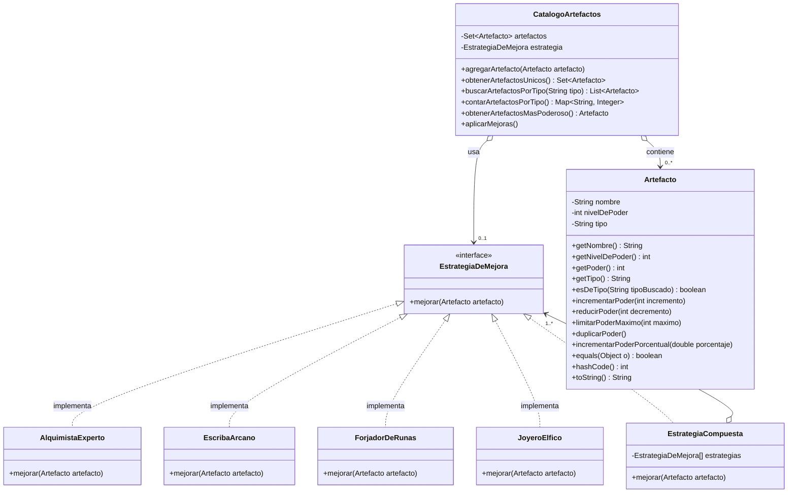

```mermaid
classDiagram
direction TB

    class EstrategiaDeMejora {
        <<interface>>
        +mejorar(Artefacto artefacto)
    }

    class AlquimistaExperto {
        +mejorar(Artefacto artefacto)
    }

    class EscribaArcano {
        +mejorar(Artefacto artefacto)
    }

    class ForjadorDeRunas {
        +mejorar(Artefacto artefacto)
    }

    class JoyeroElfico {
        +mejorar(Artefacto artefacto)
    }

    class EstrategiaCompuesta {
        -EstrategiaDeMejora[] estrategias
        +mejorar(Artefacto artefacto)
    }

    class Artefacto {
        -String nombre
        -int nivelDePoder
        -String tipo
        +getNombre() String
        +getNivelDePoder() int
        +getPoder() int
        +getTipo() String
        +esDeTipo(String tipoBuscado) boolean
        +incrementarPoder(int incremento)
        +reducirPoder(int decremento)
        +limitarPoderMaximo(int maximo)
        +duplicarPoder()
        +incrementarPoderPorcentual(double porcentaje)
        +equals(Object o) boolean
        +hashCode() int
        +toString() String
    }

    class CatalogoArtefactos {
        -Set~Artefacto~ artefactos
        -EstrategiaDeMejora estrategia
        +agregarArtefacto(Artefacto artefacto)
        +obtenerArtefactosUnicos() Set~Artefacto~
        +buscarArtefactosPorTipo(String tipo) List~Artefacto~
        +contarArtefactosPorTipo() Map~String, Integer~
        +obtenerArtefactosMasPoderoso() Artefacto
        +aplicarMejoras()
    }

    EstrategiaDeMejora <|.. AlquimistaExperto : implementa
    EstrategiaDeMejora <|.. EscribaArcano : implementa
    EstrategiaDeMejora <|.. ForjadorDeRunas : implementa
    EstrategiaDeMejora <|.. JoyeroElfico : implementa
    EstrategiaDeMejora <|.. EstrategiaCompuesta : implementa

    CatalogoArtefactos o--> "0..*" Artefacto : contiene
    CatalogoArtefactos o--> "0..1" EstrategiaDeMejora : usa
    EstrategiaCompuesta o--> "1..*" EstrategiaDeMejora : compone

```